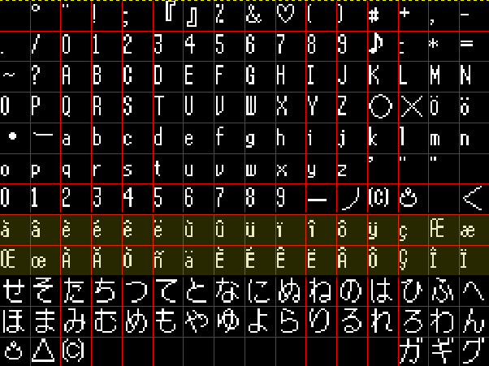
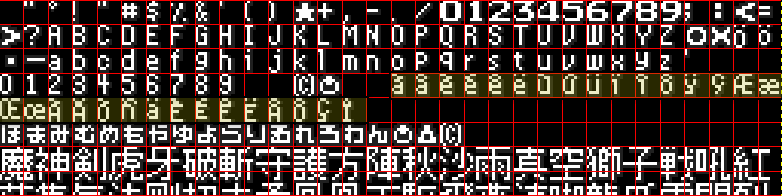

# Tales-of-Phantasia-X
Tales of Phantasia X English Translation


- **Project Managers**
  - mziab
  - Pegi

- **Project Coordinator**
  - Dragonbleapiece

- **Lead Programmer**
  - mziab

- **Programmers**
  - Ethanol
  - Julian

- **Main Translator**
  - Goodguy3

- **Translators**
  - Mine
  - SymphoniaLauren
  - Pegi
  - mziab

- **Lead Editors**
  - Dragonbleapiece
  - mziab

- **Editors**
  - Kevan
  - gatordski
  - yoh
  - Khayyaam
  - FlamePurge

- **Graphic Artists**
  - Amarant
  - FlamePurge
  - WilliamTBOG
    
- **Pre-production Information Gathering**
  - Kevan
  
- **Lead Localization QA**
  - Dragonbleapiece

- **Lead Functional QA**
  - DobleC

- **QA Testers**
  - Kevan
  - flynnforthewin
  - Nanika
  - getterdrill
  - Torasouls
  - FlamePurge
  - dotaxis
  - ryuza
  - Trixarian
  - Negi
  - bobwhite
  - edgarfigaro
  - gatordski
  - Explorer

- **Translation Feature Consultation**
  - FlamePurge

- **Original PSX Script and Translated Assets**
  - Phantasian Productions


## Discord
Join us at https://discord.gg/2KtGVNxPvD  

## Tools

### First-time setup

**Prerequisites:**
- Python 3.10+ - https://www.python.org/downloads/
- Japanese Tales of Phantasia Narikiri Dungeon X ISO

**External dependencies (Windows versions already included):**
- 7zip
- armips
- comptoe
- mkisofs
- xdelta

Optional: [PSPDEV](https://pspdev.github.io) (if you need to modify the included C code)

Windows notes:
- At the time of writing Python 3.14 may cause unnecessary complications on Windows.
- Be sure to enable ``Add Python to environment variables`` in ``Advanced Options`` when installing Python.

**1) Run ``install.bat`` to install the Python dependencies.**

**2) Put your Japanese Narikiri Dungeon X .iso in the project folder and rename it to ``topx.iso``.**

**3) Run ``extract.bat`` to extract the necessary original files (this might take a few minutes).**

### Usage

1) Make sure your translated text files are in the ``script`` directory.

When using OmegaT, you can just use ``Create Target Documents`` (or Ctrl+D) in the program and copy the contents of the ``target`` folder from your OmegaT project to the ``scripts`` folder.

2) Run ``cook.bat`` to build the translation.

If no errors occur (usually indicated by red text), the output ``topx.iso`` should appear in the ``out`` folder.

3) Optionally, you can generate an xdelta patch by running ``create-patch.bat``. It should create a ``topx.xdelta`` file in the ``out`` folder.

### Important files and folders

**Scripts:**
- ``extract.bat`` - extracts the necessary files from the ISO
- ``cook.bat`` - inserts translations and builds the translation ISO
- ``rebuild-iso.bat`` - builds the translation ISO
- ``create-patch.bat`` - creates an xdelta patch

**Fonts:**
- ``topx-font-eng.png`` - main dialogue font, 16x14 glyphs (padded to 16x16)
- ``sys_00.png`` - menu font, 8x8 glyphs
- ``topx-ttl-font.png`` - font for auto-generated copyright/version string

**Graphics:**
- ``sys_01.png``, ``nmap_main_02.png`` - Yes/No prompts, other menu icons
- ``e_00.png``, ``e_25.png`` - battle graphics
- ``op_tim0_02.png`` - opening credits
- ``ttl_dat_01-eng.png`` - title screen credits
- ``ttl_dat_07.png`` - title screen menu options

**Misc:**
- ``credits-meta.json`` - ending credits
- ``topx-dialogue-eng.tbl`` - dialogue encoding table
- ``topx-menu-eng.tbl`` - menu encoding table
- ``topx-ttl.tbl`` - encoding table for the auto-generated version string

**Folders:**
- ``dumps`` - original Japanese text dumps (and English battle quotes from Phantasian Productions)
- ``script`` - text files to be inserted
- ``asm`` - all assembly mods
- ``orig`` - original game files extracted from the ISO
- ``out`` - generated files

### Translator notes

- Most of the graphics use indexed mode with specific palettes that need to be used. Use an image editor that preserves palettes or you're going to have a bad time (insertion errors, wrong colors).
[LibreSprite](https://libresprite.github.io/)) is one good option. [GIMP](https://www.gimp.org) should also work fine, but is known to cause problems with some files, notably ``e_00.png``.

- With the exception of one monster file, skits (XML) and the ending credits (JSON), all of the text is stored as simple .txt files. Each string is terminated with ``{END}`` and an empty line.

- When editing the text be sure not to change any tags in ``{}`` or ``<>`` brackets, unless you know what you're doing.

- ``<pause>`` tags need to be put on a separate line.

- Take care not to add any spaces after ``{END}`` tags. This will break insertion and you'll get a mismatched string count error.

- Most of the text (with the exception of some menu strings) is automatically line-wrapped, so you don't need to worry about line lengths. In dialogue, a line-break can be forced by writing ``<nl>`` at the end of the line.

- If you're unused which name a particular <item_XXXX> tag corresponds to, consult ``item-ids.txt``

- To change the version number in the title screen, edit the ``TOPX_VERSION`` variable in ``cook.bat``

**NOTE**: At this time the ending credits only support English (and Japanese) glyphs.

### Language support

The tools are obviously tailored to English. Setting them up for another language involves some extra steps:

**1) Fonts:**

You will need to edit the fonts: ``topx-font-eng.png`` (dialogue font), ``sys_00.png`` (menu font)
Additional accents need to be drawn in the same order in both or wrong glyphs will be displayed in item found messages etc.

Please draw your glyphs in the space marked yellow in the screenshots:




Space is reserved for 32 additional glyphs, currently used for French accents. If more are needed, this will require additional changes to the tools and assembly. The relevant places have been marked with ``NOTE: you need to change this if you added new glyphs`` in the comments.

**2) Tables:**

You will then need to update the following encoding tables to include the new glyphs: ``topx-dialogue-eng.tbl`` (dialogue) and ``topx-menu-eng.tbl`` (menus) 

Example:

``topx-dialogue-eng.tbl``:
```
8000=à
8100=â
8200=è
8300=é
8400=ê
8500=ë
8600=ù
8700=û
8800=ü
8900=ï
...
```

``topx-menu-eng.tbl``:
```
80=à
81=â
82=è
83=é
84=ê
85=ë
86=ù
87=û
88=ü
89=ï
...
```

**3) Name entry screen (optional):**

If you need to add extra rows to the name entry screen, you will need to:

- Edit the alphabet string in ``menu/topx_prx_misc_jap.txt``:
```
ABCDEFGHIJKLMNOPQRSTUVWXYZ      abcdefghijklmnopqrstuvwxyz      [0][1][2][3][4][5][6][7][8][9].,-=+ {END}
```

The length needs to be divisible by 16. Digits ([0], [1] etc.) count as one character. If it's shorter, pad it with spaces.

- Edit the number of rows in ``asm/topx-naming-screen.asm``:
```
; NOTE: edit if you need more rows than English does
NAME_ENTRY_NUM_ROWS equ 0x5
```

**4) Code changes (advanced):**

This will require some MIPS assembly knowledge. All assembly files in the ``asm`` folder have been heavily commented, but obviously only include the changes necessary for English.
Depending on the circumstances, some debugging and additional code tweaks might be needed. 

- Menus will likely need to be tweaked to improve their alignment. Most of the relevant code is stored in ``asm/topx-menus.asm`` and ``asm/topx-battle-menus.asm``.

- Alphabetical item sorting order can be tweaked by hex-editing ``item-sort-lut.bin``.

- If you add any new accents that have descenders and need to be shifted by one pixel (similarly to y, j, g, q), you will need to edit two routines in ``asm/topx-new-code.asm``: ``menu_get_char_yoffs`` and ``battle_item_yoffs_stub``.

- Some system messages ("Replace with whom", "Can't hold any more", "Changed into", "has been lit/extinguished") have hardcoded offsets that need to be patched if the item/character name is in a different positioni than English.

Look for ``NOTE: needs to be edited if message changes`` in ``asm/topx-menus.asm``.

- If you need to change the width of battle sprites (battle menu options, battle stats) in ``e_00.png``, you will need to manually hex-edit their coords stored in ``out/e_01.bin``.

The format is AA BB CC DD (AA = x position, BB = y position, CC = width, DD = height). Coords are the pixel position and size of the sprite in ``e_00.png``.

Relevant offsets:
```
0x112 - Artes
0x11A - Strategy
0x122 - Formation
0x12A - Items
0x132 - Debug
0x13A - Order
0x272 - Level up
0x24A - EXP
0x492 - Grade
```

## Technical notes

The old technical notes have been moved [here](DEVNOTES.md).
